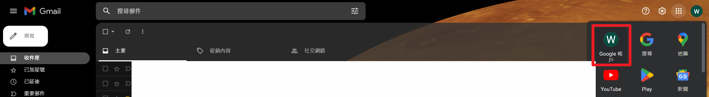
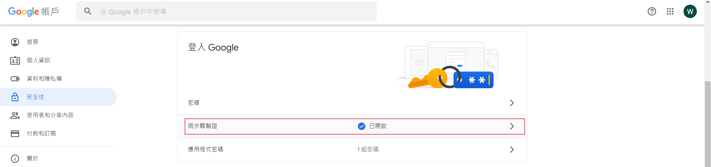
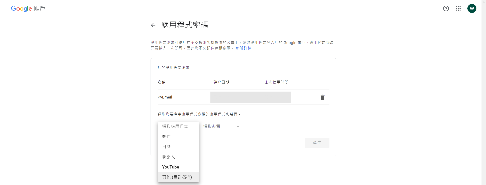
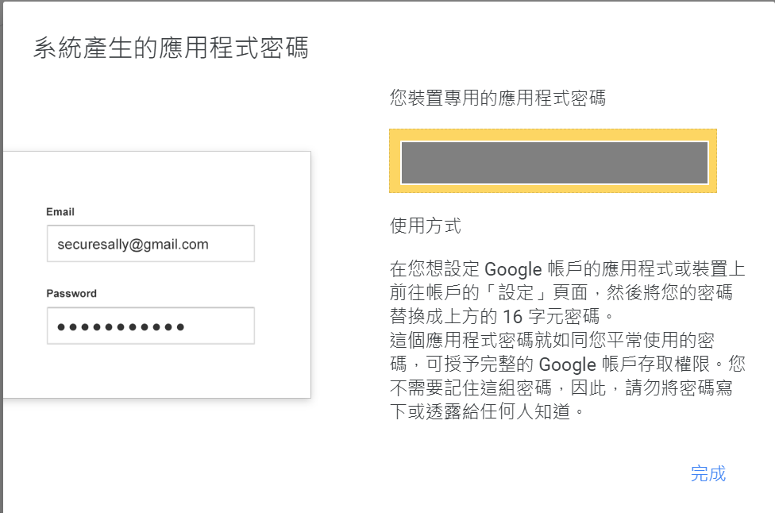
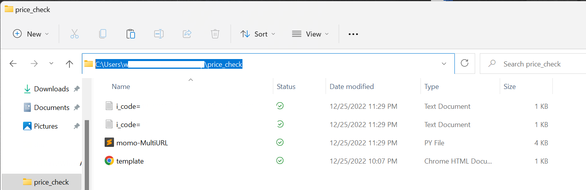
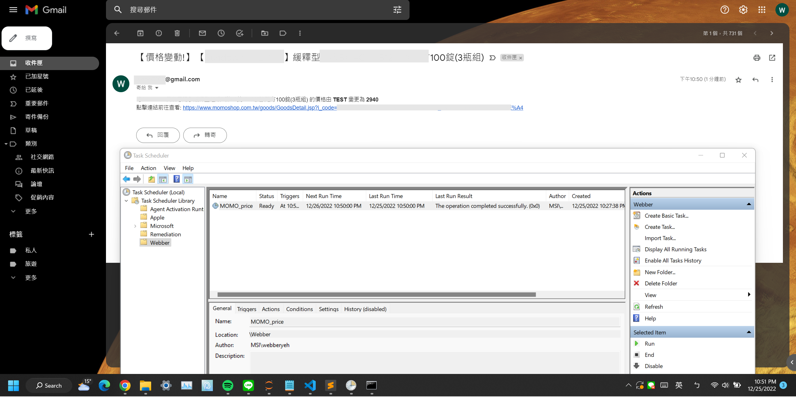

# 商品價格追蹤

## 主程式

* momo-MultiURL.py

### 前置設定與使用說明

**`主程式僅適用於momo購物中商品價格追蹤`**
<

要使用此py檔之前，必須先進行以下設定

* gmail應用程式密碼設定
    1. 至 gmail 中點開右上方應用程式列表，並點選 "google 帳戶"
    

     

    2. 點擊右側安全性標籤，依據指示設定兩步驟驗證
    

     

    3. 設定完便於剛剛"兩步驟驗證"之下方出現"應用程式密碼"之選項，進入後於選取應用程式點擊"其他(自訂名稱)"
    

     

    4. 點擊產生後，便會得到應用程式密碼，此密碼必須填入主程式中的指定區塊
    

 

* 主程式指定區塊之修改
    1. BLOCK 1: mailaddress為自己的gmail帳號，password為剛剛得到的應用程式密碼，fpath為此檔案所在資料夾的完整路徑，詳細如下圖所示，注意 **`windows路徑中的"\"在python裡為"\\"`**
    

 

    2. BLOCK 2: 輸入想追蹤的商品之URL，可輸入多個URL，中間以","分開

 

* 主程式至此已可單獨執行，但若需要設定追蹤，必須打開Task Scheduler進行設定，可至google搜尋 windows 工作排程進行進一步之設定

 

* 設定工作排程後，便可以在指定時間執行主程式，當價格有所變動時，便可以收到email通知，如下圖所示

